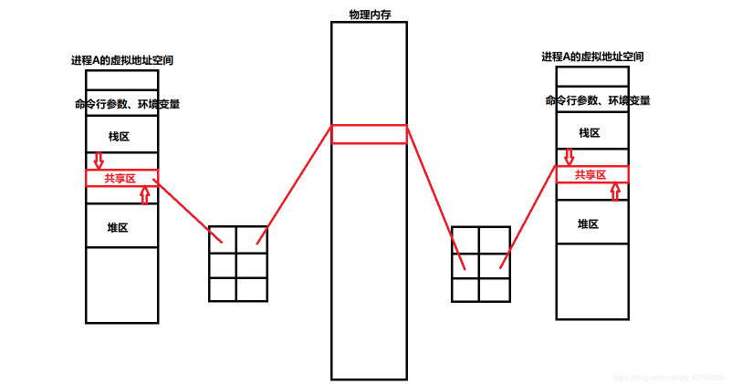

# 必要性

进程具有独立性（每一个进程都有自己的虚拟地址空间，进程A并不知道进程B的虚拟地址空间中的内容），因此导致了进程之间协作的问题

# 目的

+ 数据传输
+ 数据共享
+ 数据控制

# Linux六大进程间通信方式

+ 管道
+ 共享内存
+ 消息队列
+ 信号量
+ socket
+ 信号
+ 文件锁

# 管道

本质是一个内核中的内存，也可以将这块内存称为缓冲区，当其中的数据被读走后，管道就为空

管道是半双工的，即数据只能由一个流向 

## 匿名管道

> include <unistd.h> 
>
> int pipe(int fd[2]);
>
> 功能：创建一个匿名管道 
>
> 参数：fd[]：文件描述符数组，fd[0]表示读端，fd[1]表示写端，使用这一对文件描述符访问内存 
>
> *返回值：成功返回0，失败返回-1*

【注】：
1、pipe()函数的参数是输出型参数，也就是意味着需要传入一个int类型数组，数组大小为2，每个元素保存的都是文件描述符，当函数成功执行后，会在内核中开辟一块内存，即所谓的管道，将管道的读端和写端分别赋给fd[0]和fd[1]
2、管道使用完后，需要及时关闭文件描述符
3、管道的大小：

+ PIPE_SIZE为64k
+ PIPE_BUF为4k，指的是单次写入管道的数据大小
+ 若是写入的数据大于PIPE_BUF，则不能保证数据的原子性

### 匿名管道特性

+ **匿名管道只能用于具有亲缘关系的进程间通信**。因为访问匿名管道前提是必须知道管道的读写端的文件描述符信息，可是，没有亲缘关系的进程间互相不知道对方创建的文件描述符信息，所以不能共同操纵同一个管道进行通信。但是，在创建进程时，子进程会继承父进程的文件描述符表，因此能够获取到父进程创建的管道的文件描述符信息，所以能够访问同一管道进行通信。此外，**匿名管道没有标识**，所以不能被任意进程访问

+ 半双工，数据单向传输

+ 提供字节流服务

+ 管道的生命周期随进程

+ 如果管道为空，则读阻塞； 

  如果管道为满，则写阻塞； 

  如果管道读端被关闭，则写端往管道中写数据会造成管道破裂，导致进程收到SIGPIPE信号，从而终止进程； 

  如果管道写端被关闭，则读端读完管道中的数据之后，读端继续读的话并不会陷入阻塞状态，而是返回，执行代码的正常流程

+ 管道自同步互斥功能 。在规定的一次写入数据大小范围内，数据具有原子性，即当前读写不会被打断

## 命名管道

命名管道是具有标识符的管道，本质是内核中的一块内存，也称之为“缓冲区”

可以 通过访问管道文件来访问内核中的缓冲区

### 创建

1、命令行创建

> mkfifo [filename]

2、通过函数创建

> int mkfifo(const char *filename, size_t mode);

### 特性

+ 具有标识符，可以满足不同进程进行通信
+ 生命周期随进程
+ 其他特性都跟随匿名管道

## 命名管道和匿名管道区别

FIFO与pipe之间唯一的区别在于它们创建和打开的方式不同，一旦打开后，它们具有 相同的语义

# System V共享内存

### 原理

创建共享内存时，首先在物理内存中创建一块内存，各个进程都通过页表结构将该段内存映射到自己的虚拟地址空间上的共享区，各个进程通过映射的地址来进行通信

### 特性

+ 共享内存是最快的进程间通信。共享内存直接访问内存就可以完成通信，而管道涉及 到用户态和内核态之间的数据的相互拷贝，效率较低
+ 共享内存不带有同步互斥功能
+ 对共享内存写入数据是按照覆盖的方式进行的
+ 共享内存的生命周期随操作系统

### 使用

> // 创建共享内存
>
> int shmget (key_t key, size_t size, int shmflg); 
>
> // 将进程附加到共享内存上去
>
> void* shmat (int shmid, const void* shmaddr, int shmflg);
>
> // 分离进程和共享内存
>
> int shmdt (const void* shmaddr);
>
> // 共享内存的销毁
>
> int shmctl (int shmid, int cmd, struct shmid_ds* buf);

【相关指令】

> ipcs -m   # 查看共享内存
>
> ipcrm -m [shmid]  # 删除一个共享内存

如果删除了一个有进程附加的共享内存，操作系统的做法是，先标记当前的共享内存为destroy状态，并将key设置为0x00000000，表示当前的共享内存不能再被其它进程所附加，同时会释放内存，也就导致了正在附加该共享内存上的进程有崩溃的风险，一般禁止这样去做。当附加的进程退出的时候，操作系统就会将该共享内存清理掉

# System V消息队列

## 概念

本质上是内核中的一个优先级队列，进程通过访问优先级队列来增加节点或查看节点来进行通信

## 特性

+ 生命周期随内核，如果用户进程不删除消息队列资源，则该资源一直在操作系统内核中
+ 消息队列自带同步互斥机制
+ 可实现双向通信

# System V信号量

## 概念

本质上是一个计数器 + PCB等待队列，是对资源的计数

## 作用

实现进程的控制，即实现进程的同步互斥

## 实现互斥的原理

临界资源：系统中某些资源一次只允许一个进程使用

临界区：进程中涉及到互斥资源的程序代码段

1. 信号量只有两个取值：0 / 1,  0 表示当前资源不可用，1表示当前资源可用
2. 对进程需要访问一个临界资源的时候，会先访问信号量，预计算信号量的值：对当前信号量进行预-1操作，判断结果是否小于0
   + 小于0：表示之前信号量是0，即当前资源不可用。将当前进程放到PCB等待队列中
   + 等于0：表示之前信号量值是1，即当前资源可用。访问临界资源，并将信号量-1，标志当前进程正在访问临界资源，其他进程不能访问该临界资源
3. 如果当前进程完成了访问，则需结束对临界资源的访问。将信号量+1

上述操作中，-1操作称为P操作，+1操作称为V操作

## 实现同步的原理

同步保证了合理性

1. 信号量取值为大于0和小于0，大于0表示有多少个资源可以使用，小于0时绝对值表示有多少个进程在等待资源
2. 如果需要访问一个资源，将信号量-1
3. 如果访问资源完成，将信号量+1
4. 如果当前信号量值小于0，表示当前PCB等待队列中还有进程在等待资源，当一个进程结束对资源的访问时，应唤醒PCB等待队列中的一个进程，使之去获取资源
5. 如果当前信号量大于0，表示PCB等待队列中没有 进程在等待，则可以直接获取资源