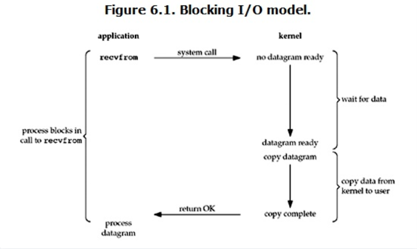
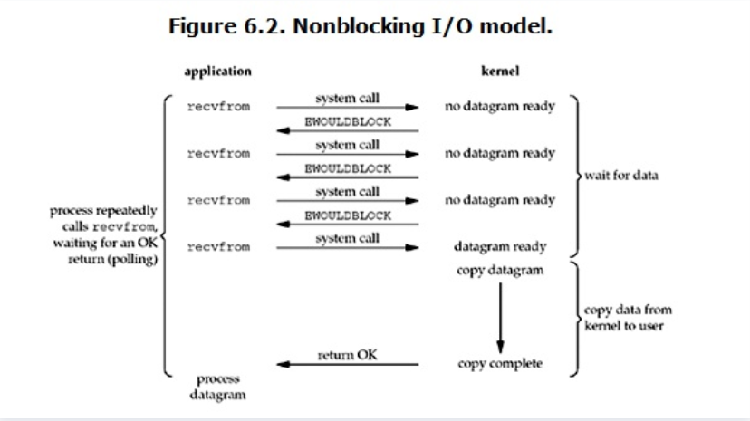
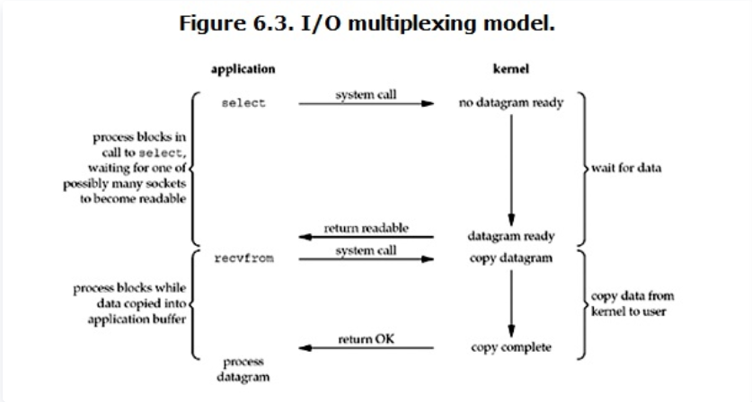
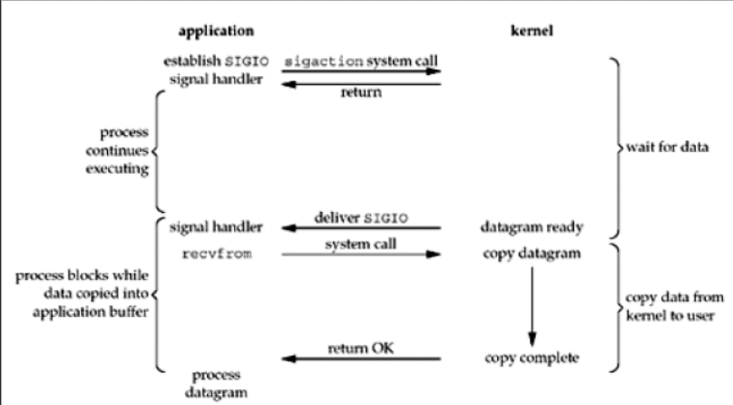
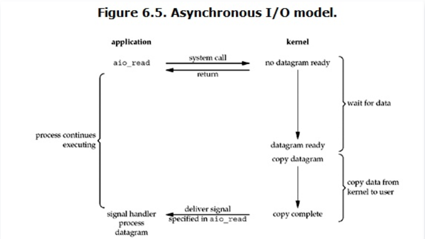

UNIX给出以下五种高级IO模型，其中，前四种为同步IO

以网络IO中的读操作为例：

+ 一般情况下，一次网络IO 读操作会涉及两个系统对象：
  - 用户进程（线程）
  - 内核对象
+ 同时包括两个处理阶段：
  - 等待数据准备好
  - 将数据从内核空间的buffer拷贝到用户空间进程的buffer

五种IO模型的异同点就是区分这两个系统对象、两个处理阶段的不同上

## 阻塞IO

如图所述，用户进程在阻塞IO中读recvfrom操作的两个阶段都是等待的：

1. 在数据没有准备好时，进程原地等待内核准备数据
2. 内核准备好数据后，进程继续等待内核将数据拷贝到自己的buffer中
3. 在内核完成数据的拷贝后，进程才会从recvfrom系统调用中返回

## 非阻塞IO

进程在非阻塞IO中读recvfrom操作的第一个阶段是不会阻塞等待的：

1. 如果内核数据还没有准备好，那么recvfrom会立刻返回一个EWOULDBLOCK错误
2. 当内核准备好数据后，进入处理第二阶段的时候，进程会等待内核将数据拷贝到自己的buffer
3. 内核完成数据拷贝后进程才会从recvfrom系统调用中返回

## IO多路复用

IO多路复用，就是常见的select、poll、epoll模型，如上图：

进程在两个处理阶段都是阻塞等待的，不过它可以**通过一种机制 一个进程能够同时等待多个IO文件描述符**，内核监视这些文件描述符，让其中任意一个描述符进入读就绪，select、poll、epoll就能反馈给用户进程，用户进程发起recvfrom系统调用，阻塞等待直到内核完成数据拷贝用户进程才从recvfrom系统调用中返回

## 信号驱动IO

当内核将数据准备好的时候，使用SIGIO信号通知应用程序进程IO操作

在UNIX中并不常用，所以不做过多介绍

## 异步IO

异步IO要求进程在recvfrom操作的两个处理阶段上都不能等待，也就是进程调用recvfrom后立刻返回，内核自行去准备好数据并将数据从内核的buffer中拷贝到用户进程的buffer，然后通知用户进程读操作完成了!!!

但是，**在Linux网络IO中并不存在异步IO，Linux网络IO处理的第二个阶段总是阻塞等待数据拷贝完成的**

