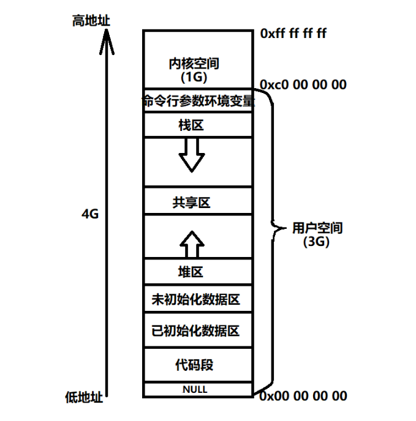

栈区stack：由编译器自动分配释放，存放函数的参数值、局部变量的值等

堆区heap：由程序员释放，若程序员不释放，测程序结束时可能由操作系统回收

# 区别与联系
1、分配方式
+ 堆是由程序员自己申请并指明大小，在C中使用malloc和free函数释放
+ 栈是由系统自动分配，如声明在函数中的一个局部变量

2、申请后系统的响应
+ 栈：只要栈的剩余空间大于所申请空间，系统将为程序提供内存，否则将报异常提示栈溢出
+ 堆：首先应该知道操作系统有一个记录空闲内存地址的链表，当系统收到程序的申请时，会遍历该链表，寻找第一个空间大于所申请空间的堆节点，然后将该节点从空闲节点链表中删除，并将该节点的空间分配给程序，并且，对于大多数系统，会在这块内存空间中的首地址处记录本次分配的大小，这样，代码中的delete语句才能正确的释放当前内存空间。另外，由于找到的堆节点的大小不一定正好等于申请的大小，系统会自动将多余的那部分重新放入空闲链表中

3、申请大小的限制
+ 在Windows中，栈是向低地址扩展的数据结构，是一块连续的内存区域。即代表着栈顶的地址和栈的最大容量是系统预先规定好的，如果申请的空间超过剩余空间时，会提示Stack Overflow（1M大小）
+ 堆是向高地址扩展的数据结构，是不连续的内存区域。这是由于系统是用链表来存储的空间内存地址的，自然是不连续的。由此，堆获得的空间比较灵活，也比较大

4、生长方向不同
+ 栈：由高地址到低地址
+ 堆：自低地址而高地址

5、申请效率
+ 栈是由系统自动分配，速度较快
+ 堆是由malloc / new分配的内存，速度较慢，而且容易产生内存碎片，不过较为方便

6、管理方式
+ 栈：自动释放
+ 堆：由程序员控制，容易产生内存泄漏

