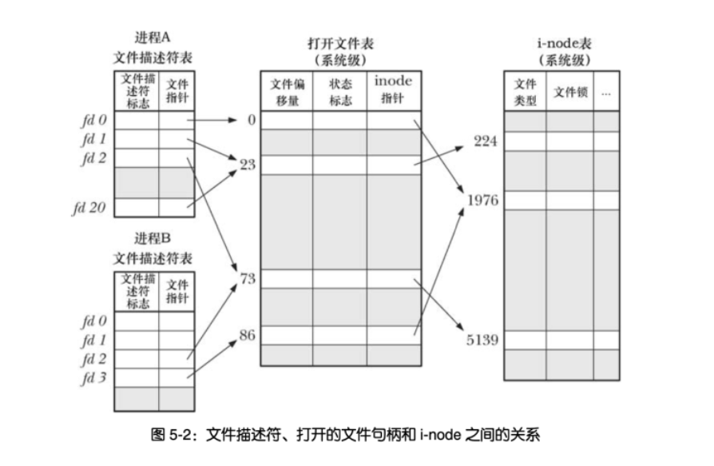
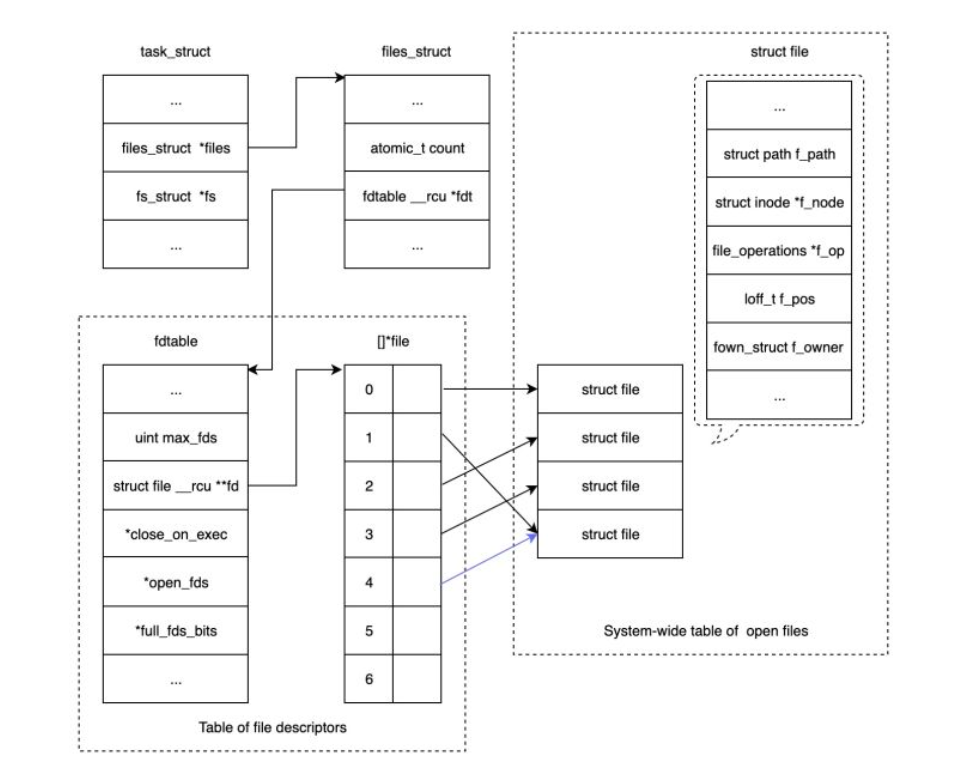

# 文件描述符的理解

内核为所有打开的文件维护了一个系统级的**描述表（open file description table）**，有时也称之为**打开文件表（open file table）**，并将表中的每个条目称为**打开文件句柄（open file handle）**。而针对每个进程，内核又为其维护了**打开文件的描述符表（open file descriptor table）**



简单来说，每个进程都有一个打开的文件表，表中的每一项都是struct file类型，包含了打开文件的一些属性比如偏移量、读写访问模式等，这是真正意义上的文件句柄

```cpp
struct task_struct {
    // ...
    /* Filesystem information*/
    struct fs_struct *fs
    /* Open file information*/
    struct files_struct        *files;
   // ...
}
struct files_struct {
  /*
   * read mostly part
   */
    // 引用计数，可以和其它 task 共享
    atomic_t count;
    bool resize_in_progress;
    wait_queue_head_t resize_wait;
    // fdtable 是每个进程相关的文件描述符表
    struct fdtable __rcu *fdt;
    struct fdtable fdtab;
  /*
   * written part on a separate cache line in SMP
   */
    spinlock_t file_lock ____cacheline_aligned_in_smp;
    unsigned int next_fd;
    unsigned long close_on_exec_init[1];
    unsigned long open_fds_init[1];
    unsigned long full_fds_bits_init[1];
    struct file __rcu * fd_array[NR_OPEN_DEFAULT];
};
struct fdtable {
    unsigned int max_fds;
    // 这里 fd 数组，维护了进程关联的文件描述符及其文件句柄的指针
    // 文件句柄可以共享（比如，dup 系统调用）
    // 但是在使用 open 系统调用的时候会创建新的 file，即文件句柄
    struct file __rcu **fd; /* current fd array */
    unsigned long *close_on_exec;
    unsigned long *open_fds;
    unsigned long *full_fds_bits;
    struct rcu_head rcu;
};
struct file {
    // ...
    // 文件路径
    struct path        f_path;
    // 指向真正的文件，inode 指针
    struct inode        *f_inode;    /* cached value */
    // 文件相关的操作
    const struct file_operations    *f_op;
    /*
     * Protects f_ep_links, f_flags.
     * Must not be taken from IRQ context.
     */
    spinlock_t        f_lock;
    enum rw_hint        f_write_hint;
    // 引用计数，只有 count 为 0 时，才会被真正地回收
    atomic_long_t        f_count;
    unsigned int         f_flags;
    fmode_t            f_mode;
    struct mutex        f_pos_lock;
    // 文件偏移
    loff_t            f_pos;
    struct fown_struct    f_owner;
    const struct cred    *f_cred;
    struct file_ra_state    f_ra;
    u64            f_version;
   // ...
}
```




# FILE

 FILE* fp：

表示 fp 是指向FILE结构的指针变量，通过 fp 即可找存放文件信息的结构变量，然后按结构变量提供的信息找到该文件，实施对文件的操作

因为IO相关函数与系统调用接口 对应，并且库函数封装系统调用。所以本质上，访问文件都是通过文件描述符访问的。所以在C库中的FILE结构体中封装了文件描述符fd

FILE的结构

> typedef struct _IO_FILE FILE;
> struct _IO_FILE {
>
>         char *_ptr;          //缓冲区当前指针
>         int   _cnt;
>         char *_base;       //缓冲区基址
>         int   _flag;          //文件读写模式
>         int   _file;           //文件描述符
>         int   _charbuf;     //缓冲区剩余自己个数
>         int   _bufsiz;       //缓冲区大小
>         char *_tmpfname;
> };


# 文件描述符和文件流指针转换

C语言文件指针域文件描述符之间可以相互转换：

> int fileno(FILE * stream)
>
> FILE * fdopen(int fd, const char * mode)


# 总结

文件描述符和文件流指针的区别：

**文件描述符**：Linux 系统一切皆文件，打开文件后就会得到一个文件描述符，是一个很小的整数，是一个索引值。内核回味每一个运行中的进程控制块PCB中维护一个打开文件的记录表，每一个表项都有一个指针指向打开的文件，上边的索引值是记录表的索引值

**文件流指针**：C语言库函数提供了文件流指针来作为I/O的句柄，文件流指针指向进程用户空间中的一个FILE结构的数据结构，**FILE结构中主要包括一个I/O缓冲区和一个文件描述符**，而这个文件描述符的值就是文件描述符表中的一个 索引

所以，文件流指针从某种意义上来说就是对文件描述符的封装，即文件句柄的句柄

【注意】：文件流指针中的FILE结构，区别于文件描述符表中的指针file*（这个指针指向一个结构体，用来保存当前文件中的基本信息（文件路径、偏移量、inode指针等））