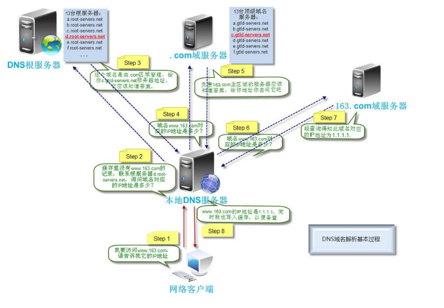

# 问题

当在浏览器中输入一个URL后，将会发生什么事情？

## 概念

URL：统一资源定位符，是资源表示最常见的形式。URL描述了一台特定服务器上某资源的特定位置。它们可以明确说明如何从一个精确、固定的位置获取资源

URL说明了协议、服务器和本地资源

浏览器都是基于HTTP协议，而HTTP是个应用层协议，HTTP无需操心网络通信的具体细节都交给了TCP/IP

## 基本流程

+ 查询ip地址
  * 浏览器解析出URL中的域名
  * 查询浏览器的DNS缓存，若浏览器中没有DNS缓存，则查找本地客户端hosts文件中有无对应的IP地址，若hosts中没有找到DNS，则查找本地DNS服务器（运营商提供的DNS服务器）有无对应的DNS缓存，若本地没有DNS缓存，则向根服务器查询，进行递归查找，递归查找从顶级域名开始，一步步缩小范围，最终客户端取得IP地址
+ 建立tcp连接，接入服务器
  * HTTP协议建立在tcp协议之上，HTTP请求前，先进性tcp连接，形成客户端到服务器的稳定的通道，即所谓的TCP三次握手建立连接
+ 浏览器发起HTTP请求
  * tcp连接完成后，HTTP请求开始，请求有多种方式，如常见的GET、POST等
  * HTTP请求包含请求头，也可能包含请求体两部分，请求头中包含我们希望对请求文件的操作的信息，请求体中包含传递给后台的参数
+ 服务器后台操作并做出HTTP响应
  * 服务器收到HTTP请求后，后台开始工作，如负载平衡，跨域等
  * 文件处理完毕，生成相应数据包，响应也包含两部分，响应头和响应体，响应体就是我们所请求的文件
  * 通过网络传输，文件被下载到本地客户端，客户端开始加载
+ 网页的解析与渲染
  * DOM（文件对象模型）构造：浏览器首先将收到的html代码，通过html解析器解析构建为一棵DOM树，接着将接受到的css代码，通过css解析器构建出样式表规则
  * 布局：浏览器从上到下，从左到右读取DOM树的文档节点，顺序存放到一条虚拟的传送带上。文档流排完之后，开始获取计算节点的坐标和大小等CSS属性，作为盒子的包装说明。然后把盒子在仓库中一一摆放，这就将节点布局到了页面
  * 绘制页面：布局完成后，我们在页面上其实是看不到任何内容，浏览器只是计算出了每一个节点对象应该被放到页面的哪个位置上，但并没有可视化，因此最后一步就是将所有内容绘制出来，完成整个页面的渲染

## DNS域名解析

+ 操作系统会**先检查自己本地的`hosts`文件**是否有这个网址映射关系，如果有，就先调用这个`IP`地址映射，完成域名解析 
+ 如果`hosts`里没有这个域名的映射，则查找**本地`DNS`解析器缓存**，是否有这个网址映射关系，如果有，直接返回，完成域名解析 
+ 如果`hosts`与本地`DNS`解析器缓存都没有相应的网址映射关系，首先会找**`TCP/ip`参数中设置的首选`DNS`服务器**，在此我们叫它**本地`DNS`服务器**，此服务器收到查询时，如果要查询的域名，包含在本地配置区域资源中，则返回解析结果给客户机，完成域名解析，此解析具有权威性
+ 如果要查询的域名，不由本地`DNS`服务器区域解析，但该服务器已缓存了此网址映射关系，则调用这个`IP`地址映射，完成域名解析，此解析不具有权威性 
+ 如果本地`DNS`服务器本地区域文件与缓存解析都失效，则根据本地`DNS`服务器的设置（是否设置转发器）进行查询，如果未用**转发模式**，本地`DNS`就把请求发至[13台根`DNS`](https://baike.baidu.com/item/%E6%A0%B9%E5%9F%9F%E5%90%8D%E6%9C%8D%E5%8A%A1%E5%99%A8/5907519?fr=aladdin)，根`DNS`服务器收到请求后会判断这个域名(`.com`)是谁来授权管理，并会返回一个负责该顶级域名服务器的一个`IP`。本地`DNS`服务器收到`IP`信息后，将会联系负责`.com`域的这台服务器。这台负责`.com`域的服务器收到请求后，如果自己无法解析，它就会找一个管理`.com`域的下一级`DNS`服务器地址(`http://qq.com`)给本地`DNS`服务器。当本地`DNS`服务器收到这个地址后，就会找`http://qq.com`域服务器，重复上面的动作，进行查询，直至找到`www.qq.com`主机
+ 如果用的是转发模式，此`DNS`服务器就会把请求转发至上一级`DNS`服务器，由上一级服务器进行解析，上一级服务器如果不能解析，或找根`DNS`或把转请求转至上上级，以此循环。不管是本地`DNS`服务器用是是转发，还是根提示，最后都是把结果返回给本地`DNS`服务器，由此`DNS`服务器再返回给客户机